# AI Derma – Skin Condition Diagnostic System

AI Derma is an intelligent system designed to assist in the early detection of skin conditions. The system analyzes user-submitted skin images and reported symptoms to provide a preliminary diagnosis and guidance.

### System Architecture

